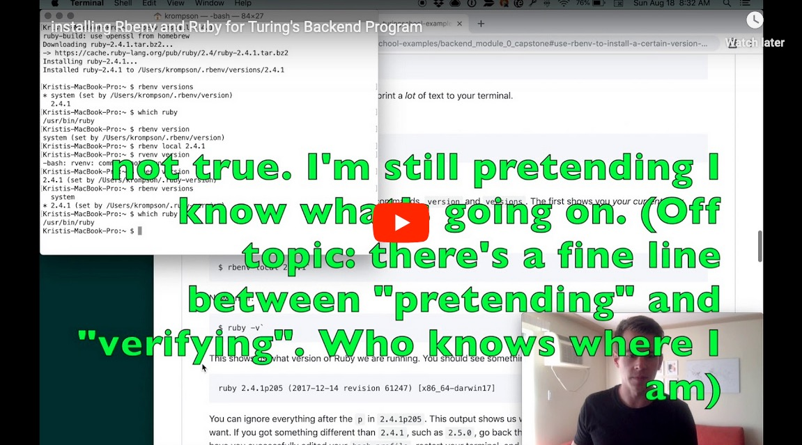

<<<<<<< HEAD
# Section 1: Super Learners

Section 1 is estimated to take a total of 6-10 hours to complete. Part C is the longest and most time intensive. This section of pre-work involves reading (both from this document as well as the 📒John Duckett book), 👩‍💻exercises, and 📝reflection questions. Make sure to manage your time well so that should you get stuck and need help, you have plenty of time to do so and meet the deadline.

- [Vocabulary](#Vocabulary)
- [Part A: Super Learner Habits](#Part-A-Super-Learner-Habits)
- [Part B: Terminal](#Part-B-Terminal)
- [Part C: Ruby Foundations](#Part-C-Ruby-Foundations)

## Vocabulary

If you've talked to any alum or near-alum of Turing, one thing they likely shared is "Turing teaches you how to learn". For creators of tech, the learning never ends. Not after graduating a program, not after 20 years of experience. We will provide more support as you are starting out, then release some of that support so you are equipped to learn on your own once you graduate. While we provide more support at the beginning, we also intentionally support you in building skills and habits that will help you do that successfully.

One of those pieces is in how developers approach vocabulary. Knowing technical vocabulary will allow you to get more out of reading doucmentation and tutorials, and will allow you to communicate well with teams and ask good questions when you need help. Each section of your pre-work (and each lesson once you start Mod 1) will start with a vocabulary section. We don't always give you the definitions - this is intentional. You will create your own definition after having several opportunities to read definitions and see examples.

Here's what we ask you do:
- Find a special spot in your notebook for vocabulary and JavaScript reserved keywords. Mark it with a post-it or bookmark, so it's easy to find and come back to
- When you start a new section of pre-work, write down each term. Leave plenty of space for (future) notes
- As you read and work through the material you will come across definitions and build an understanding of these terms. Write in definitions, draw diagrams, write out relevant code snippets, etc. If you complete a section and don't have a grasp on a term, that's when it's time to reach out to your pre-work small group or cohort, and collaborate!

### Vocabulary Terms

- command
- directory
- code comments
- String
- Number
- Boolean
- variable
- assignment operator
- re-assignment (of a variable)
- interpolation


## Part A Super Learner Habits

Read [this article](https://pubs.ppai.org/pc-today/six-habits-of-super-learners/) about the habits of Super Learners. Reflect on this - what do you already do? Does this make you want to do anything new or different as you beginthis learning journey? Jot down your notes now, and we will ask you to share some reflections with your small group at the end of this section.

## Part B Terminal

You will likely spend the majority of your time in Module 1 in either the Terminal or your text editor (Atom). When you're new to programming, the terminal can seem like a scary place, but it has some advantages over other means of interacting with your computer. Perhaps the greatest advantage is that it allows programmers to build tools that they can share with each other without going through the process of creating a graphical user interface. This makes it easy to share code quickly so that it can be used in multiple projects.

You already have had some exposure to the terminal in [Mod 0, Session 2: Terminal and Command Line](http://mod0.turing.io/session2/#terminal-and-command-line). Let's get a little more practice!

### Explore and Practice

Visit the [Turing Terminal](https://learn-terminal.turing.io/) and read through the Learn section as needed. Explore the Playground as needed.

👩‍💻 Complete all three Challenges.

### Making Things, Navigating

#### Commands

In the following section, you will get a little practice using `touch` and `mkdir` to create files and directories, and `ls` and `cd` to navigate the directory structure and check-in.

#### Terminal Practice

👩‍💻 Use `mkdir` and `touch` to create the directories/files in the structure illustrated below:

```sh
|--secretLibraryProject
    |
    |--README.md
    |--package.json
    |
    |--lib
    |  |
    |  |--secretLibrary.js
    |  |--secretBook.js
    |  |--secretLibrarian.js
    |  |--patron.js
    |  |--librarySystem.js
    |
    |--test
       |
       |--secretLibrary.js
       |--secretBook.js
       |--secretLibrarian.js
       |--patron.js
       |--librarySystem.js
```     

Don't worry about putting any text or content into these files. For now, create this structure with empty files.

Your first command should be:

```bash
mkdir secretLibraryProject
```

Note that in the command provided above, the dashes preceding the directory name were not used in the actual directory name. The dashes are just used as a diagram aide, and is a common pattern you will see in other documentation.

### Deleting Things

#### Commands

* `rm`: This will remove a file from your system. Be careful with this! The terminal assumes you're a little more of an expert than the system does. This doesn't move the file to the Trash, it removes it completely from your system. It's a little like moving the file to the trash and then deleting it immediately.

* `rm -rf`: Adding the `-r` and `-f` flags to the `rm` command will allow you to delete directories even if they have other files and/or directories inside of them. For more information on each of these flags enter `man rm` into your terminal. It will print out the manual for this command.

#### Terminal Practice

👩‍💻 Use `rm` and `rm -rf` to delete each of the files and directories you created in the `Making Things` section above.

Note that it would be possible to delete the entire directory that you created with just `rm -rf secretLibrary`. **Don't do this!** At this point it's better for you to delete each of the files and directories individually so that you get some practice with these commands, which will help you remember them better in the long run. The goal here (for this particular exercise) isn't to be efficient and creating and deleting files and directories, it's to *get practice* creating and deleting files and directories. Ultimately this practice will allow you to be more efficient in the future.

## Part C Ruby Foundations

In this section, you will begin to learn the basics of Ruby. You will work through several exercises which will help you get comfortable running files and seeing output. You will learn about ways to represent data in Ruby as Strings, Numbers, and Booleans, as well as begin to explore how to capture and work with that data.

At the end of the section, you will use several Git commands to save your work to your local Git repository. Then you will push your updates to your remote GitHub repository. For now, we are building muscle memory with git commands and getting used to seeing what output they produce. We will dive deeper into the inner workings of Git later. For now, all you need to do is follow along and know that we are using Git to save our work, and GitHub to put it on the internet.

### Open your local copy of backend-mod-1-prework in Atom

Using your terminal, open the local copy of this repository. To do this, enter these commands into your terminal (this may vary slightly depending on the names of your directories):

```
cd ~
ls
cd turing
ls
cd 0module
ls
cd backend-mod-1-prework
ls
cd section1
ls
atom .
```

This will open the `section1` directory in Atom. You should be able to see the directory and its contents in the file explorer on the left side of your Atom window.

### An Introduction to Ruby

[Read This Introduction](https://learnrubythehardway.org/book/intro.html) to the Learn Ruby The Hard Way Tutorial. To reiterate this introduction, ***DO NOT*** copy and paste code examples when working through lessons in your prework. Actually type each of them out.

### Ruby Basics Lessons

1. Next, you will complete several lessons from the Learn Ruby the Hard Way Tutorial. *For ***each*** lesson* ***follow these directions closely***:

    1. Create a file within your `section1` directory that will contain this lesson's work. Verify that you are within the directory by using terminal command `pwd`. If you are not, `cd` into your `section1` directory. Once you are there, use the `touch` command in your terminal to create a file. For the first lesson, name this file `ex1.rb`. For each subsequent lesson, use `ex2.rb`, `ex3.rb`, so on, so forth. 

    1. Work through the lesson, **typing** the code into your file, and running it in the terminal with `ruby ex1.rb`, replacing `ex1` with the actual file name of what you'd like to run. Make sure the output you get is similar to what the lesson shows. If you get an error saying "No such file or directory", be sure to verify the directory you are located in via the terminal- running command `ls` should show the file you are trying to run.

    1. Complete the Study Drills listed at the end of the lesson.

    1. Read the Common Student Questions section.

1. Check off the items below as you complete the steps you just read for each lesson. ***Remember to create a file containing your work for each lesson!***

    - [ ] [A Good First Program](https://learnrubythehardway.org/book/ex1.html)

    - [ ] [Comments in Code](https://learnrubythehardway.org/book/ex2.html)

    - [ ] [Numbers and Math](https://learnrubythehardway.org/book/ex3.html)

    - [ ] [Variables and Names](https://learnrubythehardway.org/book/ex4.html)

    - [ ] [Strings](https://learnrubythehardway.org/book/ex5.html)

    - [ ] [More Strings](https://learnrubythehardway.org/book/ex6.html)

    - [ ] [Asking for Input](https://learnrubythehardway.org/book/ex11.html)


1. Work through the [Strings](http://tutorials.jumpstartlab.com/projects/ruby_in_100_minutes.html#3.-strings) and [Numbers](http://tutorials.jumpstartlab.com/projects/ruby_in_100_minutes.html#5.-numbers) sections from Ruby in 100 Minutes. For each of these sections, open an `irb` session by typing `irb` into your terminal and type in the code snippets provided.

## Exercises
- Each section contains an exercises directory containing files where you will practice writing code.

Work through the files in the section1/exercises directory.  Complete them in this order:

1. strings   
1. numbers
1. booleans   
1. variables   
1. interpolation
1. loops

## Questions
- Each day contains a reflections.md file where you will answer questions about what you have learned.

Answer the day 1 questions within the reflections.md file. The `.md` file extension refers to markdown formatting. Markdown is a simple markup language to help format your text. [This article](https://github.com/adam-p/markdown-here/wiki/Markdown-Cheatsheet) shows everything you need for basic markdown formatting.


## Save your work in Git

When you are finished with all of the `section1` exercises and reflections, follow these steps in order to save your work to your local git repository.

1. Make sure you are in your `section1` directory. When you run `ls` in your terminal, you should see the `exercises` directory listed, as well as `README.md`, `reflection.md`, etc.
2. In your terminal, run `git status`. You should see output like this:

```
On branch main
Changes not staged for commit:
  (use "git add <file>..." to update what will be committed)
  (use "git checkout -- <file>..." to discard changes in working directory)

	modified:   exercises/interpolation.rb
	modified:   exercises/numbers.rb
	modified:   exercises/variables.rb
	modified:   reflection.md

no changes added to commit (use "git add" and/or "git commit -a")
```

The command `git status` shows us information about files we changed. Don't worry too much about understanding what this all means just yet. What's important is that you get comfortable typing `git status` often.

3. Run `git add reflection.md`.
4. Run `git status`. Your status should now look a little different:

```On branch main
Changes to be committed:
  (use "git reset HEAD <file>..." to unstage)

	modified:   reflection.md

Changes not staged for commit:
  (use "git add <file>..." to update what will be committed)
  (use "git checkout -- <file>..." to discard changes in working directory)

	modified:   exercises/interpolation.rb
	modified:   exercises/numbers.rb
	modified:   exercises/variables.rb
```

Under "Changes to be committed", It now lists "reflection.md". This means that git is getting ready to save this file. We want to do this for each file.

5. Run `git add exercises`.
6. Run `git status`. You should now see all those exercises files listed under "Changes to be committed". We just used `git add <directory name>` to add all the files located in a directory.
7. Run `git status`. You should now see all your files listed under "Changes to be committed". If there are any files listed under "Untracked files" or "Changes not staged for commit", add them using "git add <file name>".
8. Run `git commit -m "Add Section 1"`.
9. Run `git status`. You should see this output:

```
=======
# Backend Mod 1 Pre-work Repository

This repository will walk you through the Mod 1 Pre-work for the Backend program at Turing.

Each day has a folder containing a `README.md` file with instructions for the section, exercises, and questions. Please complete all the exercises and questions, as well as lessons listed in the section's README.

### Pre-work Index

* [Section 1 - SUPER LEARNERS, Terminal and Ruby Foundations](section1)
* [Section 2 - ASKING QUESTIONS, Conditionals and Methods](section2)
* [Section 3 - GROWTH MINDSET, Hashes](section3)
* [Section 4 - HOW YOU USE YOUR TIME, Objects and Classes](section4)
* [Final Prep - Final Deliverables and Submission](final_prep)

## What to Expect

Through completing this pre-work, you can expect to get practice re-enforcing what you learned/are learning in Mod 0, learn more technical content, and deeply reflect on your mindsets and habits and start thinking about which of those mindsets and habits will help you learn to code, and which of those you may need to change.

We will remind you of the best practices that follow from time-to-time, but to ground yourself in the work ahead, read them carefully.

## Best Practices: Learning to Write Code

**If you are stuck for longer than 30 minutes, know that it is always ok to ask for help!** The process of becoming a software developer is difficult, and learning to code is hard. At some point, everyone struggles. Struggle is a normal, healthy part of the learning process - don't give up if you hit a hard spot. If you consistently practice every day and don't take shortcuts, you will be on the path to learning how to code. When you reach out for help, challenge yourself to ask clear questions and use technical vocabulary. Speaking accurately about code is a great way to help lock in technical understanding. Use [this guide](https://gist.github.com/ericweissman/fb0241e226227867b6bc70a4d49227f5) to learn the optimal way to ask for help when you get stuck!

**Process over Product.** When asking for help, do your best to seek understanding rather than `the answer` or `the solution`. Even if your helper gets you a solution that works, make sure to spend time on *why* it works, rather than just accepting the solution and moving on.

**Type every line of code.** One of the best things you can do to set yourself for success is to make sure you type out all the code examples you see in the readings and exercises in this pre-work, *do not* copy and paste. The more hands-on-keyboard practice you can give yourself, the better. Copying and pasting won't help you solidify these concepts, manually typing all the code in will. This also applies to auto complete features in popular text editors. They are helpful, no doubt, but doing things the hard way at the beginning is a great way to hone your workflow later on.

**Details matter.** Pay close attention to small details in syntax, spacing, and language. The most detailed oriented you are as you're working, the more reliable and well-crafted your code will be. In programming, being detail oriented helps cut down on buggy code and difficult to use systems. It can also help you notice differences in your code, enabling you to identify typos and mistakes more quickly.

# Environment

Follow this guide step-by-step to make sure you have everything you need.

***Before proceeding***, if you have not already, complete the [mod-0 environment setup instructions](http://mod0.turing.io/setup-instructions) to install Atom, xcode-select, Homebrew, git, and Chrome.

Next We will cover the following:

*   [Installing Rbenv - a Ruby Version Manager](#set-up-ruby-environment-manager-rbenv)
*   [Installing Ruby Versions using Rbenv](#use-rbenv-to-install-a-certain-version-of-ruby)
<!-- *   [Terminal](#terminal) -->
<!-- *   [Forking and Cloning the Prework Repository](#forking-the-module-1-prework-repository) -->


First, let's get a Ruby version management tool on our machines.

 ## Set up Ruby Environment Manager: [rbenv](https://github.com/rbenv/rbenv#homebrew-on-mac-os-x)

<!-- Over the years, Ruby has evolved through various version releases over time that contain new features and upgrades. Version 0.95, the very first, was released in 1995, and at the beginning of year 2021, we're at version 2.7.

Generally, programs written in one version of Ruby will run just fine on another version, but sometimes incompatibilities can be encountered, meaning that particular program needs to be run with a specific version of Ruby.

Additionally, very useful tools called "gems" are out there that were created specifically to help developers code (specifically, the `pry` gem is very handy) and we cannot utilize these without first installing and configuring `rbenv`.

To solve potential compatibility issues, we'd like to be able to install and manage multiple versions of Ruby on our system. We would also like to be able to use gems across different versions of Ruby. These are the kinds of things `rbenv` handles. -->

### Installation

#### NOTE: If you have any issues with the `rbenv` setup, please reach out in slack in your cohort channel and we will address your issues at a later date! Your system version of ruby will work fine for your Prework exercises!

<!-- Here is a video walk-through that may be helpful for the following steps. Check it out!

Keep in mind that the steps in the video are correct, but we want you to install **ruby version 2.7.2**, per the written instructions below. --> -->

<!-- [](https://youtu.be/3DtqMlK8In0 "Video Walkthrough for RBENV and Ruby Installation") -->

Similar to Homebrew, rbenv provides a script to get everything installed. Open a terminal with Spotlight search (`Command + Space`) and enter these commands:

```
$ brew update
```
Wait a few moments for `brew` to check its current version and make sure it is ready to be used.

```
$ brew install rbenv
```
Wait again, as brew installs rbenv.

```
$ rbenv init
```

The output from your terminal should be something similar to:

```
$ rbenv init
.
.
.
# Load rbenv automatically by appending
# the following to ~/.zshrc:

eval "$(rbenv init -)"
```

This output is telling you that you will need to add the above line (beginning with `eval`) to your "bash profile".

To do this, in your terminal, enter:

```
$ atom ~/.zshrc
```

This command will open up your `ZSH Runtime Configuration` file in Atom so you can edit it. Copy the line `eval "$(rbenv init -)"` and paste it at the END of the `.zshrc` file, and save it.

Check to see if you did this step correctly by switching back to your terminal and typing `cat ~/.zshrc`. You should see `eval "$(rbenv init -)"` at the bottom of the output.

After, **close your terminal and reopen it.** This is a very important step since the bash profile is loaded each time a new terminal window is opened.

Now, check to make sure rbenv was installed properly. In your terminal, type:

```
$ rbenv versions
```

It should give you a version number rather than an error message.

More information about rbenv can be found [here](https://github.com/rbenv/rbenv#homebrew-on-mac-os-x).

### Use rbenv to install a certain version of Ruby

Now that we have rbenv installed, we're going to use it to install a specific version of Ruby: Ruby 2.7.2. This is the version we will use in the Backend Program.

If you need another version it'll be the same procedure, just replace `2.7.2` in the instructions with whichever version you want.

Install it with:

```
$ rbenv install 2.7.2
```

It will take a while to finish installing, and print a _lot_ of text to your terminal.

When it's all finished, type:

```
$ rbenv versions
```

and you should now see `2.7.2` listed.

Be careful, there are two different rbenv commands, `version` and `versions`. The first shows you _your current ruby version_. The second shows _all installed versions_.

Switch to your newly installed version with

```
$ rbenv local 2.7.2
```

Now enter:

```
$ ruby -v
```

This shows us what version of Ruby we are running. You should see something like:

```
ruby 2.7.2p105 (2018-10-18 revision 65156) [x86_64-darwin17]
```

You can ignore everything after the `p` in `2.7.2p105`- the first bit shows us we are running Ruby 2.7.2, which is what we want to verify. If you got something different than `2.7.2`, such as `2.4.1`, go back through the Rbenv installation, make sure you have you successfully edited your `bash_profile`, restart your terminal, and try again.

#### Setting the Default Version

You can tell rbenv which Ruby version you want to use by default. Let's do that with terminal command:

```
$ rbenv global 2.7.2
```

Now, let's make your terminal aware of this update with command:

```
$ rbenv rehash
```

<!-- ## Terminal

We will be referencing many terminal commands throughout the prework. It is recommended that you practice using terminal commands before getting started with section1. -->
<!--
[Check out section 1 to practice!](section1)

### Forking the Module 1 Prework Repository

Next, we are going to *fork this repository that you're reading right now*. Forking is when you copy a Github repository to your Github account to make your own changes. Think of it like a fork in the road -- you're about to make changes that differ from the main path.

In this scenario, the [Turing Github account](https://github.com/turingschool) owns this `backend_mod_1_prework` repository. You do not have permission to change anything in this repository, so you need your own copy to work on.

In order to fork the repository, follow these steps:

####  1. Make sure you are logged in to GitHub (if you are not logged in, log in and come back to this page)

####  2. You'll want to find this repository's Fork button. Scroll to the top of *this* webpage... yes, [this one](https://github.com/turingschool/backend_mod_1_prework) that you're reading right now!

####  3. Click on `Fork` in the upper right corner of the screen, just under the top banner.


####  4. On the new page, confirm that it is a "forked" copy of the repository, with your username included in the URL and repository name.


Check [github help](https://help.github.com/en/github/getting-started-with-github/fork-a-repo) out for more info about forks.

## Clone down this new repository

Now that you have forked this repository, the next thing to do is *clone* your forked repository.

Cloning is when you copy a remote Github repository to your local computer.

#### 1. In YOUR `backend_mod_1_prework` repository that your just forked, click on `Clone or Download`


#### 2. If you see `Clone with HTTPS` click on `Use SSH`

#### 3. Click on the copy icon to copy the SSH link to your clipboard.

#### 4. Open your terminal and follow the below steps to copy down this repository:

```
$ cd .
// This is a shortcut for `cd ~`, which is "change into the home directory"
$ mkdir turing
$ cd turing
$ mkdir 0module
$ cd 0module
$ git clone <ctrl-v to paste ssh link here >
Cloning into 'backend_mod_1_prework'...
remote: Enumerating objects: 678, done.
remote: Total 678 (delta 0), reused 0 (delta 0), pack-reused 678
Receiving objects: 100% (678/678), 237.94 KiB | 851.00 KiB/s, done.
Resolving deltas: 100% (332/332), done.

$ cd backend_mod_1_prework
$ git status .
// If everything worked correctly, you should see:
>>>>>>> 604d93e66304a772998366b10f0a88ad6aa1e99f
On branch main
nothing to commit, working tree clean
```

<<<<<<< HEAD
Congratulations! You just saved your work to Git! If `git status` is showing any files, add them with `git add <file name>` and commit them with `git commit -m "Add Section 1"`.

### Push to GitHub

You've saved your work to Git on your local machine, but it is not yet accessible through your remote GitHub repository. Updating our remote GitHub repository with our local changes is called pushing. Push your code with the following command:

```
git push origin main
```

You should see output _similar_ to this:

```
Counting objects: 9, done.
Delta compression using up to 4 threads.
Compressing objects: 100% (8/8), done.
Writing objects: 100% (9/9), 1.03 KiB | 1.03 MiB/s, done.
Total 9 (delta 2), reused 0 (delta 0)
remote: Resolving deltas: 100% (2/2), completed with 1 local object.
To github.com:your-username/frontend_mod_1_prework.git
   e8ebd7a..32c0ed3  main -> main
```

You should now be able to log in to GitHub, navigate to your remote prework repository and see all the work you did in this section!

## Index Links

- [Vocabulary](#Vocabulary)
- [Part A: Super Learner Habits](#Part-A-Super-Learner-Habits)
- [Part B: Terminal](#Part-B-Terminal)
- [Part C: Ruby Foundations](#Part-C-Ruby-Foundations)

🚀 [Go to Section 2](../section2)
=======
From here on out, all the work you do will be in your personal copy of this repository. Throughout Mod 0, we may call this your "prework repository" or "backend prework"... this refers to your forked copy of this `backend_mod_1_prework` repository that you have just now cloned to your device.

### IMPORTANT NOTE - PLEASE READ CAREFULLY
Do **NOT** work directly in the Github interface or use the `Edit` button to work directly from the Github version of your prework repository!

Instead, add your work in your text editor (Atom) on your local machine (laptop) - your prework involves using `git` to track changes and push your work up to Github. We will cover how to do this in Mod 0 AND we give explicit instructions on how to do this in each section of the prework!

## Get Started

Each day's `README` will walk you through the necessary steps to save your work.

To begin, open your terminal and `cd` into the `section1` directory. Follow the instructions contained in the `README.md` file, and have fun experimenting!

----------------------------------
>>>>>>> 604d93e66304a772998366b10f0a88ad6aa1e99f
